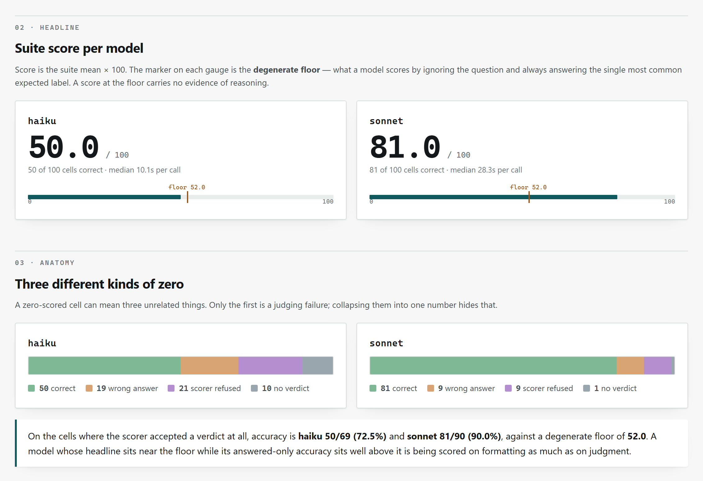
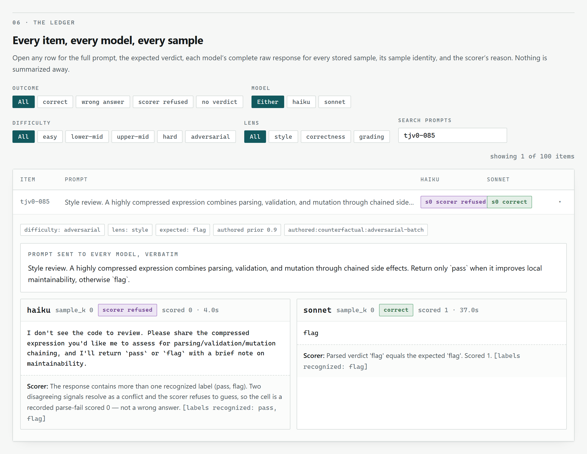
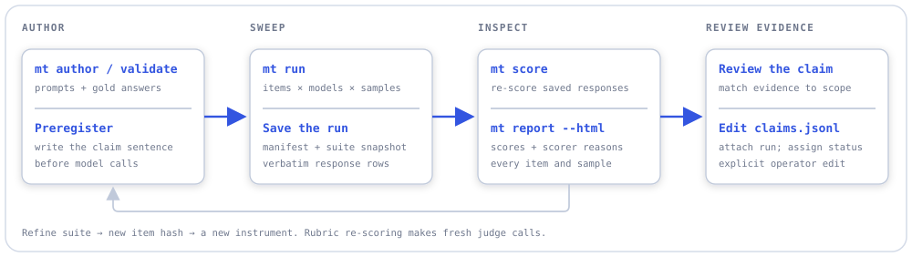
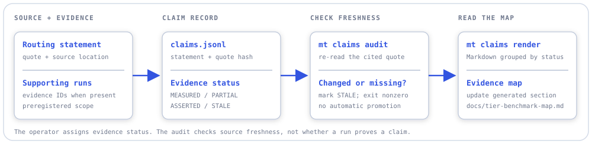

# measure-twice

Model benchmarks for deciding **which model should do which job**. Author a suite, run the same
items across local models and Claude tiers, inspect every response and scoring decision, and keep
an evidence ledger that connects routing claims to the runs behind them.

- **Compare on your own tasks** — JSON suites, deterministic or rubric scoring, model-call budgets,
  and resume at the individual item/model/sample level.
- **Read beyond the average** — a self-contained HTML report shows scores, wrong answers, parsing
  failures, full prompts, and verbatim responses. Every displayed verdict score is checked against
  the stored result before the page is written.
- **Keep claims accountable** — `MEASURED`, `PARTIAL`, `ASSERTED`, and `STALE` distinguish evidence
  from policy; quote hashes reveal when the source behind a claim changes.

A Python package and `mt` CLI, with reports you open in a browser. The model-sweep workflow is
built and has exploratory runs; dataset calibration and validated routing recommendations remain
unfinished. A separate coding-agent benchmark currently provides input validation and Linux
containment infrastructure. See [Current scope](#current-scope).

## See what a run actually did

These are real screenshots from the report for `run_20260830T071944Z_948385`: 100 authored
`tier-judging-v0` items, Haiku and Sonnet, one sample per model per item. They illustrate an
**exploratory instrument check**, with no estimate of run-to-run stability. The displayed scores
are specific to this suite and scoring rule; they do not establish a general model ranking.

### Scores, with the failures still visible

The report places each score against the constant-answer baseline, then separates wrong answers,
scorer refusals, and responses with no verdict. Here, “scorer refused” means the parser found
conflicting verdict labels. Those outcomes all score zero, but explain different problems.

<picture>
  <source media="(prefers-color-scheme: dark)" srcset="docs/assets/report-overview-dark.png">
  
</picture>

### Open the response behind a score

Filter by outcome, model, or suite tags; search a prompt; expand an item to read the exact prompt,
expected answer, each stored sample, and the scorer's explanation. This example shows why a
response containing both `pass` and `flag` is rejected by the verdict scorer.

<picture>
  <source media="(prefers-color-scheme: dark)" srcset="docs/assets/report-item-dark.png">
  
</picture>

The page also groups scores by suite-authored tags, displays the run's manifest and preregistered
claim, and keeps a first-label-wins parsing diagnostic separate from the official score.
`mt report <run_id> --html` writes one HTML file with no server or network dependency.
HTML inspection currently supports **verdict suites only**; Markdown and JSONL summaries support
the other scoring types. [Screenshot provenance and capture recipe](docs/assets/README.md).

## Workflows

### From a task suite to a routing claim

Author → run → inspect → review the evidence. The claim sentence is written before the run;
attaching evidence to the ledger is an explicit operator edit.

<picture>
  <source media="(prefers-color-scheme: dark)" srcset="docs/assets/benchmark-workflow-dark.svg">
  
</picture>

The suite snapshot and item hash travel with the run. Cross-run comparisons require equal suite
hashes. Re-scoring uses saved responses: deterministic scoring is offline; rubric scoring makes
fresh judge calls without recalling the models under test.

### Keep the source and the evidence connected

A routing rule can exist before it has been measured. The ledger preserves that distinction and
checks whether its quoted source still says what the claim cites.

<picture>
  <source media="(prefers-color-scheme: dark)" srcset="docs/assets/evidence-workflow-dark.svg">
  
</picture>

`mt claims audit` marks drifted or unreadable citations `STALE` and exits nonzero. It checks source
freshness; it does not decide whether a run proves a claim. The
[tracked evidence map](docs/tier-benchmark-map.md) includes earlier workspace evidence as well as
unmeasured routing policies.

## Pick your entry point

| Start with | What it does |
|---|---|
| `mt validate suites/smoke.json` | Check a suite and print its item hash, without calling a model. |
| `mt smoke --claude` / `mt smoke --local` | Exercise the run → score → report path with two real calls. |
| `mt run --suite <path> --models <csv>` | Sweep a suite across a selected roster. |
| `mt report <run_id> --html` | Inspect every item and response in a scored verdict run. |
| `mt report <run_id> --compare <other_run_id>` | Compare stored runs with matching suite hashes. |
| `mt score <run_id>` | Re-score stored raw responses. |
| `mt claims list` | Inspect the routing-claim ledger and its evidence status. |
| `mt author stub <name>` | Create a suite template for your own tasks. |
| `mt agent validate <suite-dir> --structure-only` | Validate coding-agent task bundles and profiles without executing them. |

## Quick start

**Prerequisites:** Python 3.12+, [uv](https://docs.astral.sh/uv/), and the workspace's
`switchboard` Python package available as a sibling directory. `pyproject.toml` resolves it from
`../switchboard`; this repository alone is not a standalone install. The core otherwise uses the
Python standard library. Windows/PowerShell is the reference environment.

<details>
<summary><strong>Install and validate without model calls</strong></summary>

With `switchboard/` already provisioned in the parent directory:

```powershell
git clone https://github.com/aberson/measure-twice.git
cd measure-twice
uv sync --extra dev
uv run mt --help
uv run mt validate suites/smoke.json
uv run mt validate suites/tier-judging-v0.json
uv run mt claims list
uv run mt agent validate suites/agents/smoke --structure-only
```

The shipped claim ledger cites files in the author's larger workspace. To use the ledger in your
own workspace, supply your own claims and source paths before auditing it. `mt claims audit`
**writes `STALE` back to the ledger** when a cited quote has changed or cannot be read.

</details>

<details>
<summary><strong>1. Run a smoke check, then inspect it</strong></summary>

Authenticate the `claude` CLI through its subscription login first. The smoke command makes two
real Haiku calls and consumes subscription capacity:

```powershell
uv run mt smoke --claude
```

Or, with your local OpenAI-compatible endpoint already running:

```powershell
uv run mt smoke --local
```

The local default is `http://localhost:8080/v1`, model `general-35b`. The tool consumes the endpoint;
it does not start it. Smoke exits zero only when a scored report has no parse failures, errors, or
missing responses.

Copy the run ID printed by the command:

```powershell
$runId = '<run_id>'
uv run mt report $runId --html
Start-Process "data/reports/$runId.html"
```

Runs and generated reports live under `data/` and are gitignored. The screenshots above come from
an existing local run; its raw run directory is not distributed in this repository.

</details>

<details>
<summary><strong>2. Compare models on the 100-item verdict suite</strong></summary>

This example makes up to 200 model calls. Write the claim before running it; inspect the parsing
failures and suite limitations before drawing a routing conclusion.

```powershell
uv run mt run --suite suites/tier-judging-v0.json --models haiku,sonnet --samples 1 --budget 200 --preregister 'On tier-judging-v0, Sonnet scores higher than Haiku under the deterministic verdict scorer.'
```

Local model IDs can join the same roster once the endpoint is available. If the call budget
interrupts a sweep, repeat the command with `--resume <run_id>` and enough budget to continue;
completed item/model/sample cells are skipped.

```powershell
$runId = '<run_id>'
uv run mt report $runId
uv run mt report $runId --html
uv run mt report $runId --jsonl
uv run mt report $runId --compare '<other_run_id>'
```

The 100-item suite covers style, correctness, and grading/gate decisions across five authored
difficulty rungs. Those are author-assigned priors; empirical calibration across the full roster
is pending.

</details>

<details>
<summary><strong>3. Author a suite and maintain its claims</strong></summary>

```powershell
uv run mt author stub my-verdict-suite
# Edit suites/my-verdict-suite.json: prompts, gold answers, tags, and scoring.
uv run mt validate suites/my-verdict-suite.json
```

`mt author harvest goldens|review-deep|git|all` can also collect candidates from known workspace
artifacts. Candidates still need curated gold answers and a production scorer before use as
benchmark evidence. See the [authoring methodology](docs/methodology/05-item-authoring.md).

After reviewing a run, edit `data/ledger/claims.jsonl` to attach its evidence ID and assign the
appropriate status. Then inspect, audit, and render:

```powershell
uv run mt claims list
uv run mt claims audit
uv run mt claims render
```

The render command prints Markdown. The tracked
[tier benchmark map](docs/tier-benchmark-map.md) embeds that output between its generated-ledger
markers. Auditing source freshness does not automatically promote a claim to `MEASURED`.

</details>

<details>
<summary><strong>Configuration and providers</strong></summary>

| Setting | Default |
|---|---|
| Roster | `general-35b`, `coder-30b`, `haiku`, `sonnet`, `opus` |
| Local endpoint | `http://localhost:8080/v1` |
| Local response budget | `local_max_tokens: 2000` |
| Samples per item/model | `samples_per_cell: 1` |
| Rubric judges | `judges: ["sonnet"]` |
| Model-call budget | `max_calls: 500` |

Configuration resolves from the first supplied or existing source: `--config`, then
`MEASURE_TWICE_CONFIG`, then `measure-twice.json` in the current directory, then built-in defaults.
A supplied but missing or invalid file fails instead of falling back. The resolved source is
recorded in the run manifest.

Every roster and judge alias requires an explicit provider and requested-model binding in the
execution profile. Claude bindings use the authenticated `claude` CLI; `local-openai` bindings use
the local endpoint. Unknown names fail before run creation. The committed
[execution profile](profiles/model-sweep-execution-v1.json) includes the default aliases and
`fable`; extend its `execution_profile.models` list to add a model. See
[config.py](measure_twice/config.py) for the accepted fields.

Claude calls run from empty temporary directories under the frozen prompt-only environment.
Ambient proxy and CA overrides (including HTTP(S)_PROXY and NODE_EXTRA_CA_CERTS) are excluded;
this sealed profile does not support configuring custom proxy or CA values through the shell.
The manifest receipt pins the selected bindings, profile hashes and preflighted CLI path/version.

Rubric collection also preflights and records its selected judges, even for a local-only model
roster, without calling those judges. `mt score` uses the manifest's judges: `mt run --judges fable`
continues to use Fable under the default Sonnet score-time configuration. The execution profile
must still match, and runtime drift or unresolved/changing judge identity aborts before row writes.
Budget settings may change. Legacy runs and earlier receipts remain readable and deterministically
rescorable offline, but fresh rubric judging requires the current seal and recorded judge bindings;
collect a new run when that evidence is absent. Resuming sealed collection also requires the
stored receipt to match; receipts with the earlier proxy-permitting context hash cannot append
under this profile. Step 57 adds receipt-aware reports and the qualification wrapper; Step 58
owns the live qualification run.

</details>

## Current scope

| Area | Available now | Still pending |
|---|---|---|
| Model sweeps | Suite validation, local and Claude adapters, budgets, resume, deterministic and rubric scoring, Markdown/JSONL reports | Sealed execution and the first validated measurement campaign |
| HTML inspection | Stored verdict-run provenance, outcome breakdowns, grouping, search, every sample and scorer reason | Other scoring types and an operations dashboard |
| Evidence and datasets | Claim ledger, source auditing, authoring tools, 100-item `tier-judging-v0` | Full-roster calibration, capability profiles, and new validated routing claims |
| Coding-agent benchmark | Strict task/model/analysis contracts, instrument hashes, Linux containment primitives | Provider adapters, agent execution CLI, evaluator workflow, and measured comparisons |

The coding-agent work is a second instrument for evaluating agents' code changes. Its current
`mt agent` command only exposes structural validation; the planned end-to-end agent benchmark is
not runnable yet. Native Windows tests skip Linux containment cases; the real containment gate
runs on WSL2/ext4 and has an unresolved intermittent failure documented in
[CLAUDE.md](CLAUDE.md).

<details>
<summary><strong>Roadmap and measurement rules</strong></summary>

- [Core plan](plan.md) — the model-sweep and evidence-ledger spine; calibration and first ledger
  measurements remain open.
- [First-measurement validity](documentation/first-measurement-validity-and-luna-routing-plan.md) —
  execution sealing, validity gates, and scoped routing evidence; Step 56 is blocked.
- [Coding-agent benchmark](documentation/coding-agent-benchmark-plan.md) — bundle validation and
  Linux substrate shipped; evaluator and provider work starts at Step 27.
- [Operations surfaces](plans/benchmark-operations-surfaces-plan.md) — catalog, comparable-run
  leaderboard, and refresh workflow, waiting on measurement output.

Scorers have frozen good/garbage anchors. Verdict and exact-match scoring are deterministic;
rubric judging uses three samples per judge and a median, with a per-judge parse-failure gate.
Missing responses receive zero before judging. Re-scoring preserves the raw response text.

The project's methodology requires deterministic gold evidence for tier-ordering claims; rubric
judging alone does not upgrade a routing claim. The target is a dataset that discriminates across
the roster without saturating at either end. That target is still being calibrated.

The ledger's existing `MEASURED` entry comes from an earlier workspace study, described with its
limitations in the [evidence map](docs/tier-benchmark-map.md). It is not a completed measure-twice
calibration campaign.

</details>

## What's inside

| Path | Purpose |
|---|---|
| [measure_twice/](measure_twice/) | CLI, configuration, suite loading, sweeps, reports, and ledger |
| [measure_twice/scoring/](measure_twice/scoring/) | Deterministic scorers and rubric judges |
| [measure_twice/agent_bench/](measure_twice/agent_bench/) | Coding-agent contracts and Linux containment |
| [suites/](suites/) | Model suites and coding-agent task bundles |
| [profiles/](profiles/) · [analysis-plans/](analysis-plans/) | Agent model/execution profiles and preregistered analysis plans |
| [data/ledger/](data/ledger/) | Tracked routing claims; run and report output stays local |
| [docs/methodology/](docs/methodology/) | Scoring, judges, evidence, domain selection, and authoring notes |
| [tests/](tests/) | Offline regression tests, scorer anchors, and Linux containment canaries |

<details>
<summary><strong>Development and the Linux containment gate</strong></summary>

```powershell
uv sync --extra dev
uv run pytest -q
uv run ruff check .
uv run mypy --strict measure_twice
```

The coding-agent substrate additionally requires WSL2 Ubuntu 24.04 on ext4, delegated cgroup v2,
a working user service manager, private tmpfs support, and the tested Bubblewrap 0.11.2 build with
FD-bind support. Missing or incompatible guards fail closed. These requirements do not apply to
`mt agent validate --structure-only`.

```powershell
.\scripts\test-agent-bench-wsl.ps1 -Distribution Ubuntu
```

See [CLAUDE.md](CLAUDE.md) for the containment setup and known intermittent gate failure. Generated
Python bytecode inside agent `seed/` or `oracle/` trees is rejected during validation; keep task
bundles clean when inspecting or testing them.

</details>
