# measure-twice

A local benchmarking toolkit for deciding **which model should do which job — with measurements instead of assertions**. It provides a Python package + `mt` CLI to author benchmark suites, sweep them across a roster of models (local OpenAI-compatible endpoints and Claude tiers), score results through calibrated instruments, and keep an **evidence ledger** that ties every model-routing claim to the run that backs it (or honestly marks it `ASSERTED`). The flagship deliverable is a *discriminative* dataset: scored 0–100, designed and iterated so no roster model saturates either end.

## Status

> **Status:** Instruments are built; **no benchmark measurement has been produced yet.** Core engine + evidence ledger complete — issues #1–#12 closed (`mt validate|run|score|report|claims|author|smoke`, a 28-claim quote-hashed ledger, and flagship dataset v0). The provider-neutral **coding-agent benchmark substrate** is shipped — issues #27–#28 closed: strict agent-suite / model-registry / analysis-plan validation behind `mt agent validate`, plus a fail-closed Linux execution substrate (FD-capability isolation, cgroup + private-tmpfs hard guards, Bubblewrap sandboxing). It can define an instrument and contain a process; **no provider adapter and no inference call exists yet.** 478 tests passing / 111 skipped (Linux-only containment cases, deselected on Windows), 0 type errors, 0 lint violations.
>
> Of the 28 ledger claims, 1 is `MEASURED` and 2 carry evidence run ids — the loop below is built end-to-end but has been *exercised* for almost none of it. That gap is the project.
>
> **Three tracks are open, none of them finished:** `plan.md` Steps 13–17 (calibration sweep → first ledger measurements) have **not started** and need the local endpoint up; coding-agent Steps 27–55 are unblocked with **Step 27 next** (#29); and the first-measurement-validity phase Steps 56–63 (#61–#68) is **BLOCKED at Step 56** (#62). Full design: [`plan.md`](plan.md) · coding-agent feature plan: [`documentation/coding-agent-benchmark-plan.md`](documentation/coding-agent-benchmark-plan.md) · validity phase: [`documentation/first-measurement-validity-and-luna-routing-plan.md`](documentation/first-measurement-validity-and-luna-routing-plan.md).

## Why

An audit of this workspace's model-routing policies found exactly **one** genuine head-to-head quality measurement behind every "which tier for which task" decision — the rest is role-shape heuristics (see [`docs/research/tier-skills-benchmark-map.md`](docs/research/tier-skills-benchmark-map.md)). measure-twice makes that gap enumerable and converts it, one pre-registered run at a time.

## Workflow

```mermaid
flowchart LR
    A["Author and curate suite<br/>mt author harvest / stub"] --> B["Validate and hash<br/>mt validate"]
    B --> P["Preregister the claim sentence<br/>written BEFORE the run"]
    P --> C["Run model sweep<br/>mt run, preregistration recorded in manifest.json"]
    C --> D["Store raw responses<br/>append-only rows.jsonl, response_raw verbatim"]
    D --> E["Score or re-score<br/>mt score, models under test never re-called"]
    E --> F["Report or compare<br/>mt report, cross-run compare needs an equal suite hash"]
    F --> G["Attach the run id to the claim's evidence<br/>hand edit of data/ledger/claims.jsonl"]
    G --> H["Audit and render the ledger<br/>mt claims audit, mt claims render"]
    F -->|"Refine suite: new items, new hash, new instrument"| A
```



`mt smoke` drives this same spine end to end on the 2-item smoke suite, with its exit
code as the gate. The coding-agent benchmark is a **second instrument on the same
doctrine** and is not drawn here: today it stops at `mt agent validate`.

## Stack

| Layer | Tool | Why |
|---|---|---|
| Runtime | Python ≥3.12 + uv | Workspace standard |
| Deps | stdlib-only core (+ `switchboard` path dep) | Agreement/kill math stays one-source-of-truth |
| CLI | `mt` (argparse entry point) | Scriptable from any project |
| Local models | OpenAI-compatible endpoint (`localhost:8080`, llama-swap) | Reuse, don't rewrite |
| Claude tiers | `claude` CLI subprocess (subscription OAuth) | No API key; budgets + resume built in |
| Storage | JSON suites · append-only JSONL runs · markdown reports | git-diffable, no DB |
| Agent sandbox | Linux FD capabilities · cgroup v2 · private tmpfs · Bubblewrap (WSL2) | Coding-agent runs are contained fail-closed, never by polling |
| Quality | pytest · ruff · mypy --strict | Frozen good/garbage anchors gate every scorer in CI |

## Prerequisites

- Windows 11 (PowerShell) — the reference environment; nothing is Windows-locked by design
- Python ≥3.12 with `uv`
- `claude` CLI authenticated (for Claude-tier sweeps)
- Optional, for local-model sweeps: an OpenAI-compatible endpoint on `localhost:8080` (operator-started; never auto-spawned)
- Optional, for the **coding-agent benchmark**: WSL2 Ubuntu 24.04 on ext4 with cgroup v2 delegation and Bubblewrap ≥0.11.2. The
  substrate is fail-closed — a missing or incompatible dependency raises `IsolationUnavailableError` rather than degrading to a
  weaker sandbox. Offline structural validation (`mt agent validate --structure-only`) is cross-platform and needs none of it.

## Setup

```powershell
git clone https://github.com/aberson/measure-twice.git
cd measure-twice
uv sync --extra dev
uv run pytest -q                 # includes anchor ordering gates
uv run mt validate suites/smoke.json
uv run mt smoke --claude         # 2-item real end-to-end run
uv run mt claims audit           # re-verify every quote-hashed ledger citation
uv run mt agent validate suites/agents/smoke --structure-only
```

The coding-agent substrate additionally carries a real-containment gate that only runs on Linux. From Windows:

```powershell
.\scripts\test-agent-bench-wsl.ps1 -Distribution Ubuntu
```

From a WSL-ext4 checkout the same cases run as `uv run pytest -q -m linux_isolation`. On native Windows those cases are
explicitly selected out and reported as skips — they are never silently absent.

## Key design decisions

- **Fail loud, never warn.** Unreachable endpoint, malformed suite, tripped judge parse-gate — runs abort. A silently degraded bench produces numbers indistinguishable from real ones.
- **Score the production artifact.** Raw responses stored verbatim; no-response force-scored 0 before any judging; scoring re-runs from stored responses (`mt score`) so **the models under test are never re-called**. Note this is not the same as "offline": a rubric suite still makes fresh k=3 judge calls when re-scored.
- **Calibrate before comparing.** Every scorer ships a frozen good/garbage anchor pair; CI asserts `score(good) > score(garbage)` forever. The flagship dataset carries an acceptance band ([5, 95] for every roster model) and a pre-registered kill criterion.
- **No judge circularity on the claims that matter.** Tier-ordering claims rest on deterministic gold answers only; LLM rubric judging (k=3, median, per-judge parse gate) profiles capabilities but never flips a ledger claim alone.
- **Evidence ledger as first-class.** Claims carry `MEASURED / PARTIAL / ASSERTED / STALE`, quote-hashed source citations, and pre-registration sentences written before the run.

## Structure

```
measure_twice/          # package: config, suite, runner, ledger, author, report, cli
  adapters/             # local endpoint + claude CLI, DI-seamed for offline tests
  scoring/              # deterministic scorers + k=3 median rubric judge
  agent_bench/          # coding-agent benchmark: strict inputs, Linux capabilities, sandboxed process
suites/                 # model suites (tier-judging-v*, smoke) + agents/ bundles (suite.json + tasks)
profiles/               # agent model registry + execution profile (kept out of suite identity)
analysis-plans/         # preregistered analysis plans, hashed into the instrument
data/                   # runs (gitignored) · ledger/claims.jsonl (tracked) · reports (gitignored)
docs/research/          # seed audits the plan is built on
docs/methodology/       # numbered learning notes, one+ per phase
docs/investigations/    # domain investigations behind the flagship dataset
docs/agent-benchmark/   # preregistrations for agent suites
documentation/          # the coding-agent benchmark feature plan
scripts/                # test-agent-bench-wsl.ps1 — the real Linux containment gate
tests/anchors/          # frozen good/garbage pairs per scorer
tests/agent_bench/      # agent-bench units + the Linux containment canaries
```

Full schemas (suite JSON, run JSONL, claim rows), phase-by-phase build steps, and the risk register: [`plan.md`](plan.md).
The provider-neutral coding-agent benchmark — wire schemas, isolation contract, and Steps 25–55 — has its own feature plan:
[`documentation/coding-agent-benchmark-plan.md`](documentation/coding-agent-benchmark-plan.md).
